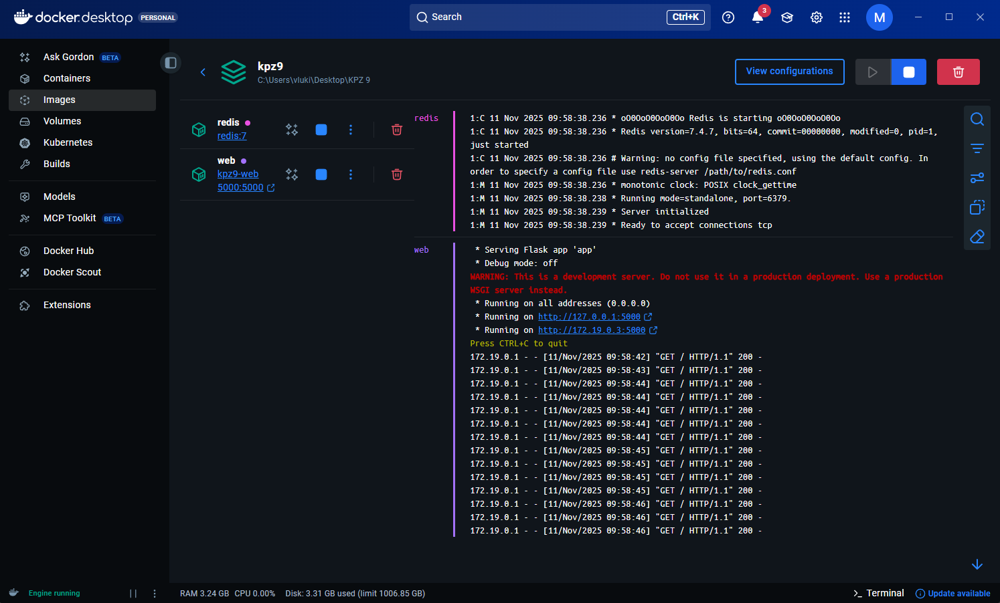
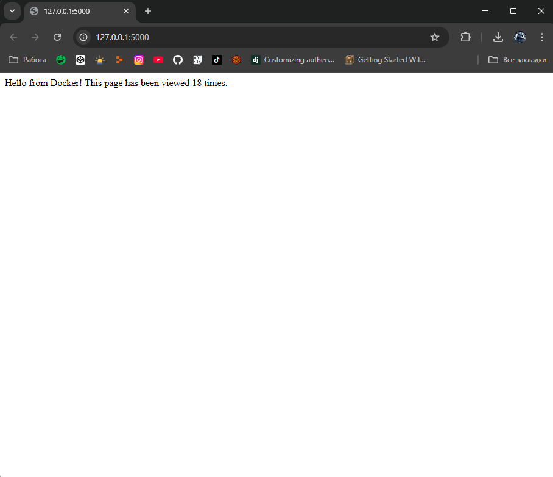

# Лабораторна робота №9
### Практичне заняття «Робота з Dockerfile та Docker Compose»

### Мета

Навчитися працювати з директивами Dockerfile і запускати ба атосервісний застосунок (Flask + Redis) за допомогою Docker Compose.

### Демонстрація роботи

Запущений контейнер в Docker Desktop

Лічильник у браузері

### Висновки

В результаті цієї роботи був отриманий повністю працюючий Flask + Redis веб-додаток в Docker контейнері із налаштованими Dockerfile та docker-compose, й, як наслідок, сам додаток повністю коректно працює всередині контейнера.

Завдяки Dpckerfile Docker знає як правильно зібрати образ мого додатку. По факту він описує середовище, в якому додаток буде працювати із 100% гарантією. Там вказано, який шар буде використовуватись при запуску, змінні середовища, створюється робоча директорія контейнера та копіюються файли проекти в контейнер (а саме вказану робочу директорію), вказані необхіні термінальні команди, порт для контейнера й команда запуску контейнера.

В свобю чергу, docker-compose - це опис того, як працюють декілька контейнерів одночасно.

В браузері, при переході за адресою ``127.0.0.1:5000`` є лічильник, реалізований завдяки Redis на кореневому роуті Flask, який при кожному вході на сторінку для  клієнта збільнує лічильник на 1.